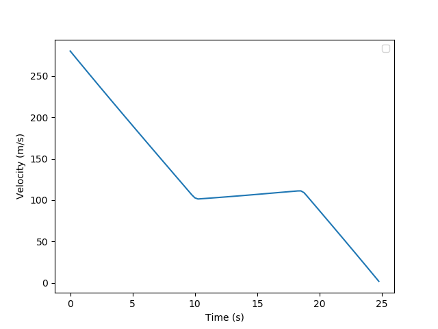

 For reusable rockets, it is needed to have precise landing of the rocket (or booster) with the desired final conditions. To do this, we need on-board real-time calulations of the trajectory planning.

 We are going to consider the 2-D problem in a flat earth with aerodynamic forces. Tacking into account aerodynamic forces, helps to optimize the fuel consumption, specially at high altitudes and large velocities.

 ## Equations 

$$ \dot{r} = Vsin\gamma$$
$$ \dot{s} = Vcos\gamma$$
$$ \dot{V} = \frac{-Tcos\epsilon-D}{m} - gsin\gamma$$
$$ V\dot{\gamma} = \frac{-Tsin\epsilon+L}{m} - gcos\gamma $$
$$ \dot{m} = -T/I_{sp}$$

We can use the following relation for the weight:

$$ mg = \frac{mg_0}{\bar{r}^2}$$

where $\bar{r} = r/R0$.

But we are going to use dimensionless variables and overload the notation for simplicity. To obtain the dimensionless variables we are going to use R0, g0 and m0, so the velocity coefficient is $\sqrt{R0\cdot{}g0}$, the time coefficient is $\sqrt{R0/g0}$, and the force coefficient is $m0\cdot{}g0$. 

The dimensionless equation are:

$$ \dot{r} = Vsin\gamma$$
$$ \dot{s} = Vcos\gamma$$
$$ \dot{V} = \frac{-Tcos\epsilon-D}{m} - \frac{sin\gamma}{r^2}$$
$$ \dot{\gamma} = \frac{-Tsin\epsilon+L}{mV} - \frac{cos\gamma}{r^2V} $$
$$ \dot{m} = -T/I_{sp}$$

We want to linearize the previous equations, so we are going to start with the aerodynamic forces.

$$ L(\alpha, M) = 0.5 \rho S_{ref}V^2C_L(\alpha, M) $$

$$ D = 0.5 \rho S_{ref}V^2C_D$$

where the coefficient $C_D$ is related to $C_L$ if we use the polar equation so:

$$ C_D = C_{D_0} + C_{D_i}*C_L^2$$

The linearization process will consist in two steps. First, we are going to remove the non-linear dependency on $\alpha$ of $C_L$ by using the fact that $\alpha$ is a control variable, and using the linear formula for the lift coefficient:

$$ C_L = C_{L_0} + C_{L_i} * \alpha$$

We can divide by $C_{L_{max}}$, where $C_{L_{max}}$ is the value which maximize the lift / drag ration, and define the new variable $\eta$:

$$ \eta = \frac{C_L}{C_{L_{max}}} $$

So $\eta_{max} = 1$, and we can assume that $\eta$ is linear between $\eta_{min} > 0$ and $\eta_{max}$. And the control variable will be defined as:

$$u_1 = \eta / m$$.

With this relation we can define the lift as:

$$ L / m = L_{max} * u_1 $$

Now, to linearize the drag, we will start by calculating the drag coefficient that maximizes the lift to drag ratio, where the drag can be calculated using the polar equation:

$$C_D = C_{D_0} + C_{D_i}C_L^2 $$

so the lift to drag is:

$$ L/D = C_L / C_D = \frac{C_L}{C_{D_0} + C_{D_i}C_L^2} $$

The $C_L$ to maximize this ration can be found by deriving with respect to $C_L$ and finding the maxima:

$$ \frac{d(C_L / C_D)}{dt} = \frac{C_{D_0} + C_{D_i}*C_L^2-2C_L^2C_{Di}}{(C_{D_0} + C_{D_i}C_L^2)^2} = 0$$

So

$$C_L^* = \sqrt{\frac{C_{D_0}}{C_{D_i}}}$$

$$ D = D_{max}(\frac{C_{D_0} + C_{D_i}C_L^2}{2C_{D_0}}) = 0.5D_{max}(1 + C_L^2/(C_L^*)^2)$$

So if we define $u_2 = \eta^2/m^2$ we have:

$$ D/m = 0.5D_{max}(1/m + m*u_2)$$

And finally, the remaining terms that we need to linearize are $Tcos \epsilon$ and $Tsin \epsilon$.

So:

$$u_3 = Tcos \epsilon / m$$
$$u_4 = Tsin \epsilon / m$$
$$u_5^2 = u_3^2 + u_4^2$$

And to simplify the equations we can make the change of variables $Z = log(m)$ and

$$\dot{m}/m = \dot{z}$$

so the last equation is:

$$\dot{z} = u_5/I_{sp}$$

## Equations

After making the equations dimensionless and linearizing them with respect to the control variables (T, $\alpha$, $\epsilon$), we have the following equations: 

$$ \dot{r} = Vsin\gamma$$
$$ \dot{s} = Vcos\gamma$$
$$ \dot{V} = -u_3 - 0.5D_{max}(\exp(-z) + \exp(z)*u_2) - \frac{sin\gamma}{r^2}$$
$$ \dot{\gamma} = -u_4/V +L_{max}u_1/V - \frac{cos\gamma}{r^2V} $$
$$ \dot{z} = -u_5/I_{sp}$$

We can put these equation in matrix form with $x = (r, s, V, \gamma, z)$ and $u = (u_1, u_2, u_3, u_4, u_5)$.

$$\dot{x} = B(x)u + f(x)$$ 

$$
B(x) = \begin{bmatrix} 
0 & 0 & 0 & 0 & 0 \\
0 & 0 & 0 & 0 & 0 \\
0 & -0.5\hat{D}e^z & -1 & 0 & 0 \\
\hat{L}/V & 0 & 0 & -1/V & 0 \\
0 & 0 & 0 & 0 & -1/I_{sp} \\
\end{bmatrix}
$$

$$
f(x) = \begin{bmatrix} 
Vsin\gamma \\
Vcos\gamma \\
-sin\gamma/r^2-0.5\hat{D}e^{-z} \\
-cos\gamma/(r^2V) \\
0 \\
\end{bmatrix}
$$

We are going to partially linearize the equations, which means that we are going to linearize the term $f(x)$ around a "solution" $x_k$, but leaving the term $B(x)u$ unchanged as $B(x_k)u$.

$$ f(x) = f(x_k) + \left. \frac{\partial f(x)}{\partial x}\right \rvert_{x_k}(x-x_k)$$

And defining

$$A(x_k) = \left. \frac{\partial f(x)}{\partial x}\right \rvert_{x_k}$$

$$ c(x_k) = f(x_k) - A(x_k)x_k$$

So we are left with the following first-order differential equation:

$$\dot{x} = A(x_k)x + B(x_k)u + c(x_k)$$

Now we are going to proceed to discretize the previous equation:

$$\frac{x_i - x_{i-1}}{\Delta h} = \frac{1}{2}(A(x_i^{(k)})x_i^{(k)} + A(x_{i-1}^{(k)})x_{i-1}^{(k)} + B(x_i^{(k)})u_i + B(x_{i-1}^{(k)})u_{i-1} + c(x_i^{(k)}) + c(x_{i-1}^{(k)}))$$

$$x_i = x_{i-1} + \frac{\Delta h}{2}(A(x_i^{(k)})x_i^{(k)} + A(x_{i-1}^{(k)})x_{i-1}^{(k)} + B(x_i^{(k)})u_i + B(x_{i-1}^{(k)})u_{i-1} + c(x_i^{(k)}) + c(x_{i-1}^{(k)}))$$

$$i = 1, 2, ...,  N$$

## Constraints
 We have two set of constraints, the problem constraints which consists of the final state, and physical constraints such as the maximum attack angle change rate, and the maximum change in the thrust angle change rate.

 The other set of constraints are those to between the control variables that we have defined to linearize the problem.

 ### Physical constraints

 The thrust angle $\epsilon$ has a maximum and a minimum value. The tricky part to implement this constraint is that we don't have $\epsilon$ as the control parameter, but $u$, so we need to define the constraint as a function of $u_3$ and $u_4$. We know that $u_4/u_3 = tan\epsilon$, where luckily we can move the $u_3$ parameter to the right side na dmake the constraint linear. So we have the following two equations:

 $$ u_4 \ge u_3tan\epsilon_{min}$$

  $$ u_4 \le u_3tan\epsilon_{max}$$

This constraint has been relatively easy to convert, but the constraint on the maximum and minimum angle of attack is harder to do. The idea is that we can use the maximum and minimum lift that we can obtain (or equivalently the maximum and minimum value of the parameter $\eta$), and then we could obtain the angle of attack to obtain such a lift. So the constraint that we want is:

$$ \eta_{min} \le \eta \le \eta_{max}$$

We have defined $u_1 = \eta/m$ so:

$$ \eta_{min}/m \le u_1 \le \eta_{max}/m$$

And $m = e^{-z}$:

$$ \eta_{min}e^{-z} \le u_1 \le \eta_{max}e^{-z}$$

This is not a linear equation. Linearizing it around $z_k$.

$$ e^{-z} = e^{-z_k} - e^{-z_k}(z - z_k)$$

$$ \eta_{min}(e^{-z_k} - e^{-z_k}(z - z_k)) \le u_1 \le \eta_{max}(e^{-z_k} - e^{-z_k}(z - z_k))$$

Similarly for $u_2$ we have:

$$ 0 \le u_2 \le \eta_{max}^2(e^{2-z_k} - 2e^{-2z_k}(z - z_k))$$

The last control variable that we have is the thrust T, which we have implemented using $u_5$. This constraint is:

$$ T_{min} \le T \le T_{max}$$

$$ T_{min}/m \le u_5 \le T_{max}/m$$

And similarly as for the other constraints:

$$ T_{min}(e^{-z_k} - e^{-z_k}(z - z_k)) \le u_1 \le T_{max}(e^{-z_k} - e^{-z_k}(z - z_k))$$

 ### Terminal conditions

 $$ r(x_f) = 0 $$
 $$ s(x_f) = s_f $$
 $$ V(x_f) < 2 m/s $$
 $$ \gamma(x_f) = -\pi / 2 $$
 $$ \epsilon(x_F) = 0$$

 This last equation can be translated to:

 $$u_4(x_f) = 0$$

 ### Auxiliary constraints

 In order to linearize the problem, we have introduce the axuliary control variable $u$, but most of these variables are not independent, and there exists some conditions that they must fulfill, so we have to implement them as restrictions.

 $$u_1^2 = u_2$$

 We can use this constraint as it is, so we are going to use the same method as for other things, and we are going to linearize the non-linear term around $x_k$.

 $$ u_1^2(x) = u_1^2(x_k) + 2*u_1(x_k)*(u_1(x) - u_1(x_k))$$

 So the constraint is left as:

 $$  u_1^2(x_k) + 2*u_1(x_k)*(u_1(x) - u_1(x_k)) = u_2(x)$$

 And:

 $$u_3^2 + u_4^2 = u_5^2$$

 This constraint is harder to implement. One of the main difficulties that I've found was in implementing the maximumthrust angle rate constraint. But we can relax it by using the convex constraint $u_3^2 + u_4^2 \le u_5^2$, and it can be proven that this condition is fulfill automatically with the rest of constraints. 

 To implement this constraint in the relaxed form we can use the same linearization trick as earlier, although here it is not as exact because the variations can be larger, so even if it works, it is something that could be improved.

 $$ u_i^2(x) = u_i^2(x_k) + 2*u_i(x_k)*(u_i(x) - u_i(x_k))$$

 $$ 2u_{3_k}u_3 + 2u_{4_k}u_4 - 2u_{5_k}u_5 \le u^2_{3_k} + u^2_{4_k} - u^2_{5_k}$$

### Constraints to help with the iterative solver

In our problem we are using the solution to the previous iteration, $x_k$, in order to help solve the next iteration, and using it it to linearize some equations. Because of this reason we are going to impose some restrictions to enforce that the two solutions are no so different.

$$ |x - x_k| \le \delta $$

$$ |u_1 - u_{1_k}| \le \delta_u $$

We only impose the condition on the control variable $u_1$. And the values for $\delta$ and $\delta_u$ are going to be:

$$ \delta = [1 km, 1 km, 200 m/s, 50º, 3000Kg]$$

$$ \delta_u = 0.5$$

## Solution

### Solution Iteration

### Final solution

