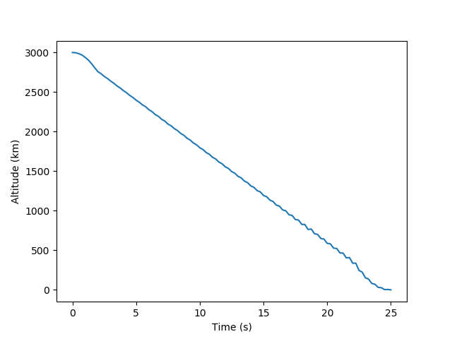
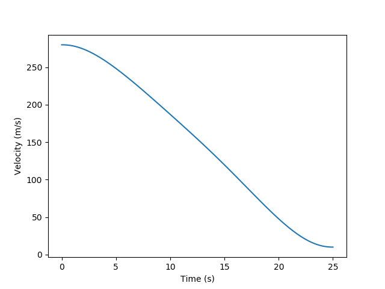
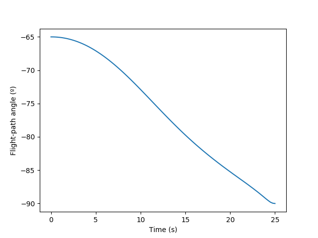
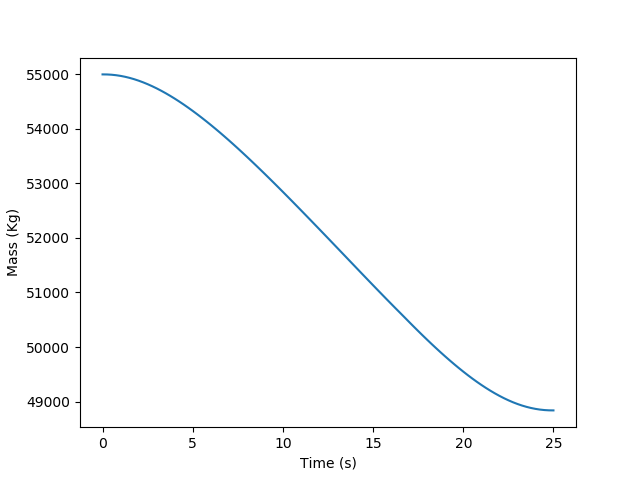
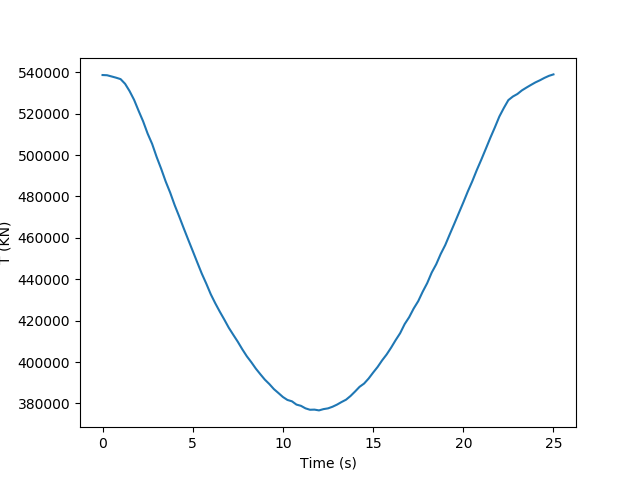
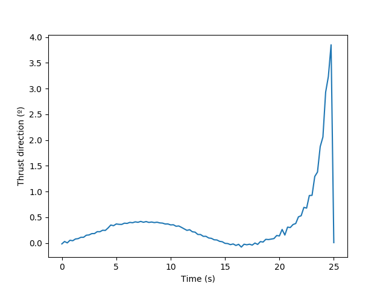

## Numerical Solution of Differential Equations

We need to discretize the continuous-time optiomal control problem to a non-linear programming problem (NLP). We can discretize the function solution to the differential equation by a finite-dimensional Lagrange polynomial. So the derivative in the dynamic constraint can be obtained using the Lagrange polynomial approximation.

We will approximate the function $y(t)$ using the Lagrange polynomials using N support points ($t_1$,...,$t_N$), called the discretization points, such that, for the approximated function $Y(t)$

$$ Y(t_i) = y(t_i)$$

Using the Lagrange polynomials we get:

$$ Y(t) = \sum_{i=1}^{N}y_iL_i(t)$$

## Collocation

A method to convert a continuous-time differential equation into a set of finite-dimensional algebraic equations is collocation. We choose a set of points $(t_1,...,t_N)$ over the interval $[t_0, t_f]$ to be used as discretization points, so we can approximate the function $y(t)$ as:

$$ y(t) \approx Y(t) = \sum_{i=1}^N a_i\phi_i(t)$$

where $a_i=a(t_i)$ is the test function evaluated at the point $i$ and $\phi_i$ is the trial function, which is the basis.
In pseudospectral methods, the Lagrange polynomial is used as trial function. And the trial function is the function $y(t)$ itself.

To discretize the dyamical equations, we need to know also the derivative. Because the Lagrange polynomials are derivable, we can get the derivative of the approximated function as:

$$ \dot{Y}(\tau_j) = \sum_{i=1}^N y(t_i)\dot{L}(\tau_j)$$

We can susbtitute this equation in the dynamic differential equation to obtain the collocation condition, where the right-hand side of the equation is just the function evaluated at each if the intermediate points, called collocation points.

$$ \dot{Y}(\tau_j) = \sum_{i=1}^N y(t_i)\dot{L}(\tau_j) = f(y(\tau_j), \tau_j)$$

In pseudospectral methos, the collocation points are obtained by orthogonal collocation methods. The collocation points are the roots of a polynomal that is a member of a family of orthogonal polynomials.

In this method we use the Legendre-Gauss collocation points, which are the roots of the Legendre polynomials [1].

In python we can find this points using the sympy.integrals.quadrature.gauss_legendre function.

<pre><code>
from sympy.integrals.quadrature import gauss_legendre
import numpy as np

# n is the number of points
# m is the number of decimals 
points = gauss_legendre(n, m)
</code></pre>

# Radau Pseudospectral Method

The dynamic equations are:

$$ \frac{dy(\tau)}{d\tau} = \frac{t_f-t_0}{2}f(y(\tau),u(\tau), \tau)$$

with the boundary conditions:

$$ \phi(y(-1), t_0, y(+1), t_f) = 0$$

In the Radau pseudospectral method we have the equations:

$$ \sum_{i=1}^{N+1}Y_i\dot{L}_i(\tau_k) = \frac{t_f-t_0}{2}f(Y(\tau_k),U(\tau_k), \tau_k)$$

## Derivative of the Lagrange Polynomials at Construction Points

The Lagrange basis polynomials with points $x_i$ is

$$ L_j(x) = \prod_{k \ne j}\frac{x-x_k}{x_j-x_k}$$

The derivative can be computed as:

$$ L_j'(x) = L_j(x) \cdot \sum_{k \ne j}\frac{1}{x - x_k}$$

But numerically, this formula fails in points which are equal to some of the construction points because of divisions by zero, so we are going to use the expanded definition:

$$ L_j'(x) = \sum_{l \ne j}\frac{1}{x_j - x_l}\prod_{m \ne (j,l)}\frac{x-x_m}{x_j-x_m}$$

## Equations

We are going to apply the Randau pseudospectral method to the following equations:

$$ \dot{r} = Vsin\gamma$$
$$ \dot{s} = Vcos\gamma$$
$$ \dot{V} = \frac{-Tcos\epsilon-D}{m} - gsin\gamma$$
$$ V\dot{\gamma} = \frac{-Tsin\epsilon+L}{m} - gcos\gamma $$
$$ \dot{m} = -T/I_{sp}$$

which using dimensionless variables is:

$$ \dot{r} = Vsin\gamma$$
$$ \dot{s} = Vcos\gamma$$
$$ \dot{V} = \frac{-Tcos\epsilon-D}{m} - \frac{sin\gamma}{r^2}$$
$$ \dot{\gamma} = \frac{-Tsin\epsilon+L}{mV} - \frac{cos\gamma}{r^2V} $$
$$ \dot{m} = -T/I_{sp}$$

As a first estimation we are not going to implement the other constraints, which describe the maximum rate of change of the thrust angle and the angle of attack.

## Code

### Lagrange Derivative

Here we ccalculate the first derivative of the Lagrange polynomials, as we have described earlier. We store the coefficientes in a cache so we don't have to calculate them every time, which is quite slow.

<pre><code>
std::map<std::pair<int, int>, double> dl_cache;

double alternative_dl(int j, double t, int i) {
	if (dl_cache.find(std::make_pair(j, i)) != dl_cache.end()) {
		return dl_cache[std::make_pair(j, i)];
	}

	double y = 0.0;
	double t_j = coll_points[j];
	for (int l = 0; l < n + 1; l++) {
		if (l != j) {
			double t_l = coll_points[l];
			double k = 1.0 / (t_j - t_l);
			for (int m = 0; m < n + 1; m++) {
				if (m != j && m != l) {
					double t_m = coll_points[m];
					k = k * (t - t_m) / (t_j - t_m);
				}
			}
			y = y + k;
		}
	}
	dl_cache[std::make_pair(j, i)] = y;
	return y;
}

double objective(const std::vector<double> &x, std::vector<double> &grad, void *my_func_data) {
	return -x[(n + 1)*nx - 1];
}
</code></pre>

### Dynamic constraints

The dynamic equality constraints are implemented as two inequality conditions. We can do this by passing a parameter with can be +1/-1, and we multiply the constraint by this value. In the left hand side of the equation, we have the sum of the first derivative of the lagrange polynomials evaluated at the collocation points, multiplied by the value of the function at this points. The right hand side of the equation is just the dynamic functions evaluated at the collocation points.

<pre><code>
typedef struct {
    int k;
	int sgn;
} constraint_data;

void constraint(unsigned a, double *res, unsigned b, const double *x,
	double *gradient, void *data) {
	constraint_data *d = reinterpret_cast<constraint_data*>(data);
	int k = d->k, sgn = d->sgn;

	for (int i = 0; i < nx; i++) {
		res[i] = 0.0;
	}

	double t = coll_points[k];
	for (int idx = 0; idx < nx; idx++) {
		for (int i = 0; i < n + 1; i++) {
			res[idx] += alternative_dl(i, t, k)*x[i*nx + idx];
		}
	}

	double r = x[k*nx];
	double V = x[k*nx + 2];
	double gamma = x[k*nx + 3];
	double m = x[k*nx + 4];
	double L0 = 0.5 * rho * V * V * Sref * g0 * r0 / (m0*g0);
	double L = x[(n + 1)*nx + k * nu] * L0;
	double D = 0.3*L;
	double T = x[(n + 1)*nx + k * nu + 1] * Tmax;
	double eps = x[(n + 1)*nx + k * nu + 2];

	res[0] -= (tf - t0) / 2.0*(V*sin(gamma));
	res[1] -= (tf - t0) / 2.0*(V*cos(gamma));
	res[2] -= (tf - t0) / 2.0*((-T * cos(eps) - D) / m - sin(gamma) / (r*r));
	res[3] -= (tf - t0) / 2.0*((-T * sin(eps) + L) / (m*V) - cos(gamma) / (r*r*V));
	res[4] -= (tf - t0) / 2.0*(-T / Isp);

	for (int i = 0; i < nx; i++) {
		res[i] *= sgn;
	}
}
</code></pre>

### Lower and Upper Bounds

The lower and upper bounds contain some of the physical constraints of the problem, and are not just -inf/+inf.

- The maximum value of the distance r is the initial distance R0. And the minimum value is the final value 0.
- In a similar way, the maximum value of the velocity is the initial velocity, and the minimum value the final velocity, which is not exactly 0 to avoid division by infinities, and is instead a very small value.
- The gamma bounds are also between the final value and the initial value.
- Obviusly, the maximum value of the mass is the initial value, but we don't know the final value, as it's the quantity that we want to optimize. But we can make a prediction.
- The lift and thrust is between 0 and 1, and then we can multiply by the maximum values.
- The thrust angle is between a minimum and maximum value that is given as input.

<pre><code>
std::vector<double> createLowerBound(int m) {
	std::vector<double> v(m, 0.0);

	v[0] = 1.0 + r0;
	v[1] = 0.0;
	v[2] = V0;
	v[3] = gamma0;
	v[4] = 1.0;
	for (int i = nx; i < (n)*nx; i += nx) {
		v[i] = 1.0;
		v[i + 1] = 0.0;
		v[i + 2] = Vf;
		v[i + 3] = -PI / 2;
		v[i + 4] = 0.8;
	}
	v[n*nx] = 1.0;
	v[n*nx + 1] = 60 / R0;
	v[n*nx + 2] = Vf;
	v[n*nx + 3] = gammaf;
	v[n*nx + 4] = 0.8;

	for (int i = (n + 1)*nx; i < (n + 1)*(nx + nu); i += nu) {
		v[i] = 0.0;
		v[i + 1] = 0.2;
		v[i + 2] = eps_min;
	}

	return v;
}

std::vector<double> createUpperBound(int m) {
	std::vector<double> v(m, 0.0);

	v[0] = 1.0 + r0;
	v[1] = 0.0;
	v[2] = V0;
	v[3] = gamma0;
	v[4] = 1.0;
	for (int i = nx; i < (n)*nx; i += nx) {
		v[i] = 1.0 + r0;
		v[i + 1] = 1.0;
		v[i + 2] = V0;
		v[i + 3] = PI / 2;
		v[i + 4] = 1.0;
	}
	v[n*nx] = 1.0;
	v[n*nx + 1] = 60/R0;
	v[n*nx + 2] = Vf;
	v[n*nx + 3] = gammaf;
	v[n*nx + 4] = 1.0;

	for (int i = (n + 1)*nx; i < (n + 1)*(nx + nu); i += nu) {
		v[i] = 1.0;
		v[i + 1] = 1.0;
		v[i + 2] = eps_max;
	}

	return v;
}
</code></pre>

### Initial value

We have to add a estimation of the solution to the solver. This estimation will be just the interpolation between the initial value and the final value. Since we don't know the final value of the mass, we can just keep it constant.
The control can be initially any physical value.

<pre><code>
std::vector<double> createInitialSolution(int m) {
	std::vector<double> v(m, 0.0);

	for (int i = 0; i < (n + 1)*nx; i += nx) {
		double r = 1.0 + r0 * (n - i / nx) / n;
		double s = 0.0;
		double V = Vf + (V0 - Vf)*(n - i / nx) / n;
		double gamma = gammaf + (gamma0 - gammaf)*(n - i / nx) / n;
		double m = 1.0;

		v[i] = r;
		v[i + 1] = s;
		v[i + 2] = V;
		v[i + 3] = gamma;
		v[i + 4] = m;
	}
	for (int i = (n + 1)*nx; i < (n + 1)*(nx + nu); i += nu) {
		v[i] = 1.0;
		v[i + 1] = 1.0;
		v[i + 2] = 0.0;
	}

	return v;
}
</code></pre>

### Rest of Code

<pre><code>
#include <iostream>
#include <vector>
#include <iomanip>
#include <nlopt.hpp>
#include <math.h>
#include <map>
#include "legendre_rule_fast.hpp"

double PI = acos(-1.0);
double R0 = 6378.137e3;
double g0 = 9.8;
double m0 = 55000;
double Rref = 2.0;
double Sref = (Rref*Rref) * PI;
double rho = 1.225;

double r0 = 3.e3 / R0;
double V0 = 280 / sqrt(g0*R0);
double s0 = 0.0;
double gamma0 = -65 * PI / 180;

double rf = 1.0;
double sf = 0.0;
double Vf = 10 / sqrt(g0*R0);
double gammaf = -PI / 2;

double Isp = 443 / sqrt(R0 / g0);
double Tmax = 1375.6e3 / (m0*g0);
double eps_max = 10 * PI / 180;
double eps_min = -10 * PI / 180;
double eps_max_rate = 5 / 180 * PI * sqrt(R0 / g0);

int n = 100;
int nx = 5;
int nu = 3;

double t0 = 0;
double tf = 25 / sqrt(R0 / g0);

std::vector<double> coll_points;

int main() {

	nlopt::opt opt("LN_COBYLA", (n+1)*(nx+nu));

	coll_points = legendre(n-1, -1.0, 1.0);
	coll_points.insert(coll_points.begin(), -1.0);
	coll_points.push_back(1.0);

	opt.set_lower_bounds(createLowerBound((n + 1)*(nx + nu)));
	opt.set_upper_bounds(createUpperBound((n + 1)*(nx + nu)));

	opt.set_min_objective(objective, NULL);

	std::vector<constraint_data> data1(n);
	std::vector<constraint_data> data2(n);
	for (int i = 0; i < n; i++) {
		data1[i].k = i;
		data1[i].sgn = 1;
		data2[i].k = i;
		data2[i].sgn = -1;
	}
	std::vector<double> tolerances = {1e-3, 1e-3, 1e-3, 1e-3, 1e-3 };
	for (int i = 0; i < n; i++) {
		opt.add_inequality_mconstraint(constraint, &data1[i], tolerances);
		opt.add_inequality_mconstraint(constraint, &data2[i], tolerances);
	}

	opt.set_xtol_rel(1e-4);

	//opt.set_maxeval(1);

	std::vector<double> x = createInitialSolution((n + 1)*(nx + nu));

	double minf;

	try{
		opt.optimize(x, minf);
		
		FILE * pFile;
		pFile = fopen("output.txt", "w");
		fprintf(pFile, "%d %d %d\n", n, nx, nu);
		for (int i = 0; i < n+1; i++)
		{
			for (int j = 0; j < nx; j++) {
				fprintf(pFile, "%.8f ", x[i*nx+j]);
			}
			fprintf(pFile, "\n");
		}
		for (int i = 0; i < n + 1; i++)
		{
			for (int j = 0; j < nu; j++) {
				fprintf(pFile, "%.8f ", x[(n+1)*nx + i*nu + j]);
			}
			fprintf(pFile, "\n");
		}
		fclose(pFile);

		return EXIT_SUCCESS;
	}
	catch(std::exception &e) {
		std::cout << "nlopt failed: " << e.what() << std::endl;
		return EXIT_FAILURE;
	}
}
</code></pre>

## Solution

## Results
 We can see in the previous plots the solution that we obtain with a tolerance of $1.0e-3$, but it's not the optimal solution, as it takes too much time to calculate.

 This solution has taken around 3-4 hours to calculate, which is much slower than the solution to the linearized equations described in the other post. This makes sense, as in the other problem we spent time in si
 mplifying the equations, while in this method we have moved all this complexity to the solver.

[1] https://en.wikipedia.org/wiki/Legendre_polynomials

[2] ADVANCES IN GLOBAL PSEUDOSPECTRAL METHODS FOR OPTIMAL CONTROL. By. Divya Garg.