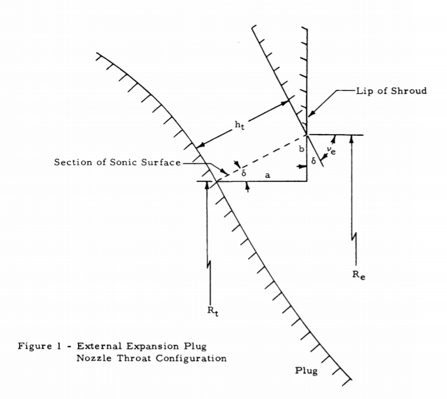
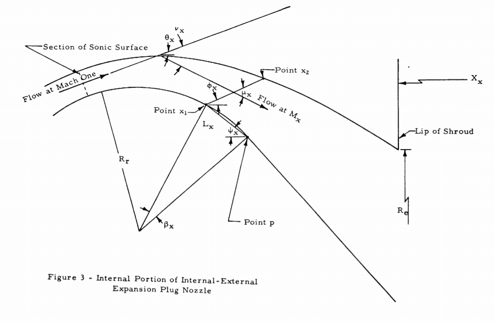

The external expansion plug nozzle is, as it name explains, a type of plug nozzle where all the supersonic expansion occurs externally.

 [2]


If the supersonic flow is expanded from a given pressure to a lower pressure around a convex corner, a Prandtl-Meyer expansion fan is generated, and the velocity is increased in the direction of the Mach number increase. The expansion fan consists of an infinite number of Mach waves, diverging from the sharp corner, which we can approximate by a finite series of waves. The flow deflection ocurring as the supersonic flow expands to a given Mach number or pressure ratio is called the Prandtl-Meyer angle. Its value, as a function of the final mach number is.

$$ \nu_e = \left(\frac{\gamma+1}{\gamma-1}\right)^{1/2}tan^{-1}\left[ \frac{\gamma-1}{\gamma+1} (M_e^2-1)\right]^{1/2} - tan^{-1} (M_e^2-1)^{1/2}$$

 [3]

### Calculate exit Mach number

In a one-dimensional isentropic supersonic flow, the relation between the area ratio (based on the throat area) and the Mach number is [1]:

$$ \frac{A}{A*}=\epsilon = \frac{1}{M}\left[ \left(\frac{2}{\gamma + 1}\right) \left( 1 + \frac{\gamma - 1}{2}M^2\right) \right] ^{\frac{\gamma+1}{2(\gamma-1)}}$$

where $\epsilon$ is defined as an expansion ratio.

The expansion ration is given as input, so in order to calculate the exit Mach number, we can rearrange the previus equation as:

$$ f(M_e) = M_e\epsilon - \left[ \frac{2+(\gamma-1)M_e^2}{\gamma+1}\right]^{\frac{\gamma+1}{2(\gamma+1)}}$$

This equation can be solved using the Newton-Raphson method by repating the following process:

$$ M_{e_{n+1}} = M_{e_{n}} - \frac{f(M_{e_{n}})}{f'(M_{e_{n}})}$$

The derivative of the function is:

$$ f(M_e) = \epsilon - \left[ \frac{2+(\gamma-1)M_e^2}{\gamma+1}\right]^{\frac{3-\gamma}{2(\gamma+1)}}$$

But the previous method doesn't converge for most initial values, so we are going to modify the process by multiplying the delta element by a small number k:

$$ M_{e_{n+1}} = M_{e_{n}} - k \frac{f(M_{e_{n}})}{f'(M_{e_{n}})}$$

By doing this process until $\Delta M$ is within the desired limit, we can obtain the exit mach number.

```python
## Calculate exit Mach number

## Initial estimation exit Mach number
rm = 5.0

## Expansion ratio
XP = 30.0

while True:
    fme = rm*XP - ((2 + (gamma - 1)*rm*rm) /
                   (gamma + 1))**((gamma + 1)/(2*(gamma - 1)))

    fpm = XP - ((2 + (gamma - 1)*rm*rm) /
                (gamma + 1)) ** ((3 - gamma)/(2*(gamma - 1)))

    dm = fme / fpm * 0.01

    if (abs(dm) < 1.0e-7):
        break

    rm = rm - dm

print('Mach exit number: {}'.format(rm))
```

## Throat configuration of external expansion plug nozzle

With the total flow turning angle calculated from the Prandtl-Meyer relation, we can calculate the geometry of the throat gap.

 [4]

The ratio of throat gap to the radius at the shroud $R_e$ is:

$$ \frac{h_t}{R_e}=\frac{\epsilon - [\epsilon(\epsilon-sin\delta)]^{1/2}}{\epsilon sin\delta}$$

## Calculating the plug contour

In order to calculate the contour of the plug we are going to solve for the Mach number by iterating from $M_x=1$ to $M_x=M_e$ after discretizing the interval in N elements.

$$ \Delta M = \frac{M_e - 1}{N}$$

 [4]

$$ \frac{R_x}{R_e} = \left[1 - {\frac{\left[ \left( \frac{2}{\gamma+1}\right) \left( 1 + \frac{\gamma-1}{2}M_x^2 \right) \right]^{\frac{\gamma}{2(\gamma-1)}}sin(\nu_e-\nu_x+\mu_x)}{\epsilon}} \right]^{1/2}$$

The pressure ration can be calculated with the expression:

$$ \frac{P_x}{P_e} = \left(1 + \frac{\gamma-1}{2} M_x^2 \right)^{\frac{\gamma}{\gamma-1}}$$

```python
xn = N
drm = (rm - 1)/xn
xm = 1
k = 1
rxre = 1 - ht*math.sin(delta)
xxre = (-ht)*math.cos(delta)

a3 = (-gamma)/(gamma-1)
pxpc = (1 + 0.5*(gamma-1)*xm*xm)**a3

rx0 = rxre
pr0 = pxpc

for j in range(xn):
    a = math.sqrt((gamma-1)*(xm*xm-1)/(gamma+1))
    b = math.sqrt((gamma+1)/(gamma-1))
    c = math.sqrt(xm*xm-1)
    c = math.atan(c)
    vx = b*math.atan(a)-c
    
    y = 1/xm
    ux = math.atan2(y, math.sqrt(1-y*y))

    ## Ratio of radius of point x to radius of shroud
    
    a2 = (gamma + 1)/(2*(gamma-1))
    b2 = (2/(gamma+1))*(1+0.5*(gamma-1)*xm*xm)
    rxre = 1-(b2**a2)*math.sin(ve-vx+ux)/xp
    rxre = math.sqrt(rxre)

    phix = ve-vx+ux

    ## Ratio of x co-ordinate of point x to radius of shroud
    xxre = (1 - rxre) / math.tan(phix)

    ## Ratio of pressure at point x to chamber pressure
    a3 = (-gamma)/(gamma-1)
    pxpc = (1 + 0.5*(gamma-1)*xm*xm)**a3

```


## External Internal expansion plug nozzle design

There is another design where only part of the supersonic flow is expanded externally, and part is expanded internally.


 [2]

If we assume
that the internal expansion is a simple corner expansion, the
total expansion angle is the sum of the internal and external
expansions.

If we specify the pressure ratio at the end of the internal expansion, we can calculate the mach number at the end of the internal expansion with:

$$ M_ei = \left[ \frac{2}{\gamma-1}\left[ \left( \frac{P_ei}{P_e} \right)^{-\frac{\gamma-1}{\gamma} } - 1  \right] \right]^{1/2}$$

And the internal flow turning angle can be obtained from the Prandtl-Meyer relation:


$$ \nu_{ei} = \left(\frac{\gamma+1}{\gamma-1}\right)^{1/2}tan^{-1}\left[ \frac{\gamma-1}{\gamma+1} (M_{ei}^2-1)\right]^{1/2} - tan^{-1} (M_{ei}^2-1)^{1/2}$$

 [4]

The last point of the plug contour can be calculated by the equations of the external expansion:

$$ \frac{R_p}{R_e} = \left[ 1 - \frac{\left[ \left(\frac{2}{\gamma+1}\right)\left(1 - \frac{\gamma-1}{2}M{ei}^2\right)^{\frac{\gamma}{2(\gamma-1)}} \right]sin\phi_{ei}}{\epsilon} \right]$$

$$ \frac{X_p}{R_e}=\frac{\frac{R_p}{R_e}-1}{tan\phi_{ei}}$$

And to calculate the internal part of the expansion by calculating the contour of the plug, we can discretize the Mach number between 1 and $M_{ei}$ in N intervals, and do the following process.

The Prandtl-Meyer angle at any location can be calculated with:

$$ \nu_{x} = \left(\frac{\gamma+1}{\gamma-1}\right)^{1/2}tan^{-1}\left[ \frac{\gamma-1}{\gamma+1} (M_{x}^2-1)\right]^{1/2} - tan^{-1} (M_{x}^2-1)^{1/2}$$

The flow of point Pis assumed to be perpendicular to the radius of the circular arc contour. The central angle $\beta_x$ is:

$$ \beta_x = \phi_t - 90º - \nu_x + |\theta_e|$$

The chord length:

$$ \frac{L_x}{R_e} = 2\frac{R_r}{R_e}sin0.5\beta_x$$

And from the geometry we get:

$$ \psi_x = 180 - \phi_t + \nu_x - \frac{180 - \beta_x}{2}$$

$$ \frac{R_{x_1}}{R_e} = \frac{R_p}{R_e} + {L_x}{R_e}sin\psi_x$$

$$ \frac{X_{x_1}}{R_e} = \frac{X_p}{R_e} - {L_x}{R_e}cos\psi_x$$

$$ \phi_x = 2\nu_{ei}-\nu_e-\nu_x+\mu_x$$

$$ \frac{R_{x_2}}{R_e} = \left[ \frac{R_{x_1}}{R_e} + \left[ \left( \frac{2}{\gamma+1} \right)\left(1+\frac{\gamma-1}{2}M_x^2\right)\right]^{\frac{\gamma+1}{2(\gamma-1)}} sin\phi_x\right]^{1/2}$$

$$ \frac{X_{x_2}}{R_e} = \frac{X_{x_1}}{R_e} + \frac{\frac{R_{x_2}}{R_e} - \frac{R_{x_1}}{R_e}}{tan\phi_x}$$

```python
## Exit Prandtl-Meyer turning angle ve
a = math.sqrt((gamma - 1.0)*(rm*rm-1.0)/(gamma + 1))
b = math.sqrt((gamma + 1)/(gamma-1))
c = math.sqrt(rm*rm - 1)
c = math.atan(c)
ve = b*math.atan(a) - c

## Mach number at the end of internal expansion
rmei = peipc**((1 - gamma)/gamma)
rmei = (2/(gamma-1))*(rmei-1)
rmei = math.sqrt(rmei)

## Internal flow turning angle
a = math.sqrt((gamma - 1.0)*(rmei*rmei-1.0)/(gamma + 1))
b = math.sqrt((gamma + 1)/(gamma-1))
c = math.sqrt(rmei*rmei - 1)
c = math.atan(c)
vei = b*math.atan(a) - c

y = 1/rmei
uei = math.atan(y / math.sqrt(1-y*y))
thei = vei - ve

## Slope of the last internal expansion wave
phei = thei + uei

## Calculate the origin of the last internal expansion wave
a1 = (2/(gamma + 1))*(1 + 0.5*(gamma - 1)*rmei*rmei)
a1 = a1**((gamma + 1)/(2*(gamma-1)))
b1 = math.sin(phei)
rpre = math.sqrt(1 - a1*b1/xp)
xpre = (rpre - 1)*math.cos(phei)/math.sin(phei)

xn1 = N1
drm = (rmei - 1)/(xn1)
k = 0
xm = 1

r = []
x = []

r2 = []
x2 = []

for j in range(N1):
    i = j
    
    a = math.sqrt((gamma - 1.0)*(xm*xm-1.0)/(gamma + 1))
    b = math.sqrt((gamma + 1)/(gamma-1))
    c = math.sqrt(xm*xm - 1)
    c = math.atan(c)

    ## Prandtl-Meyer angle at x
    vx = b*math.atan(a) - c

    ## Central angle
    bx = pht - 1.570796 - vx + abs(thei)

    ##Chord length
    xlre = 2*rrre*math.sin(0.5*bx)
    
    psi = 3.1416 - pht + vx - 0.5*(3.1416 - bx)
    
    rx1re = rpre + xlre*math.sin(psi)
    xx1re = xpre - xlre*math.cos(psi)

    if k == 0:
        rx2re = math.sqrt(rx1re*rx1re + math.sin(pht)/xp)
        xx2re = xx1re + (rx2re - rx1re)*math.cos(pht)/math.sin(pht)
    else:
        ux = math.atan(1/(xm*math.sqrt(1-(1/xm)**2)))
        phx = 2*vei - ve - vx + ux
        a2 = (2/(gamma+1))*(1 + 0.5*(gamma-1)*xm*xm)
        b2 = 0.5*(gamma + 1)/(gamma-1)
        rx2re = math.sqrt(rx1re*rx1re + (a2**b2)*math.sin(phx)/xp)
        xx2re = xx1re + (rx2re - rx1re)*math.cos(phx)/math.sin(phx)

    k = k+1

    xm = xm + drm

    r.append(rx1re)
    x.append(xx1re)

    r2.append(rx2re)
    x2.append(xx2re)

r2.append(1.3)
x2.append(xx2re)
```

And the design of the extenral part can be calculated with the process in the previous section.


## Computational Calculation of the Aerospike Rocket Nozzle with Fluent

If we implement the previous geometry in order to run the simulation with fluent, we obtain the following results: 


## References
[1] https://www.grc.nasa.gov/www/k-12/airplane/isentrop.html

[2] Performance of Plug-Type Rocket Exhaust Nozzles. K. HERMAN and; F. W. CRIMP Jr.

[3] https://en.wikipedia.org/wiki/Prandtl%E2%80%93Meyer_expansion_fan

[4] FORTRAN PROGRAMS FOR PLUG NOZZLE DESIGN, C. C Lee