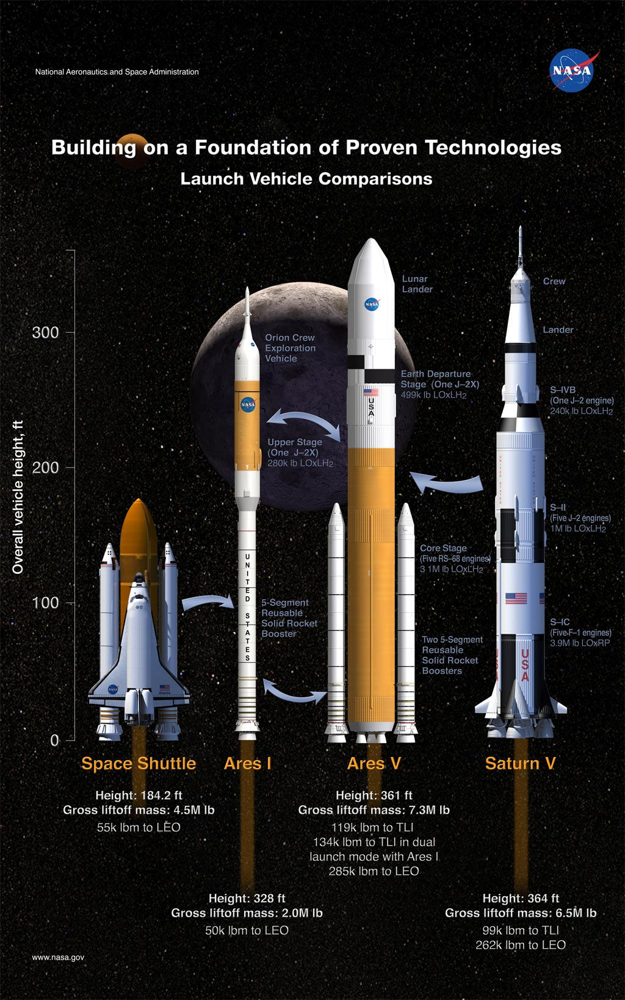
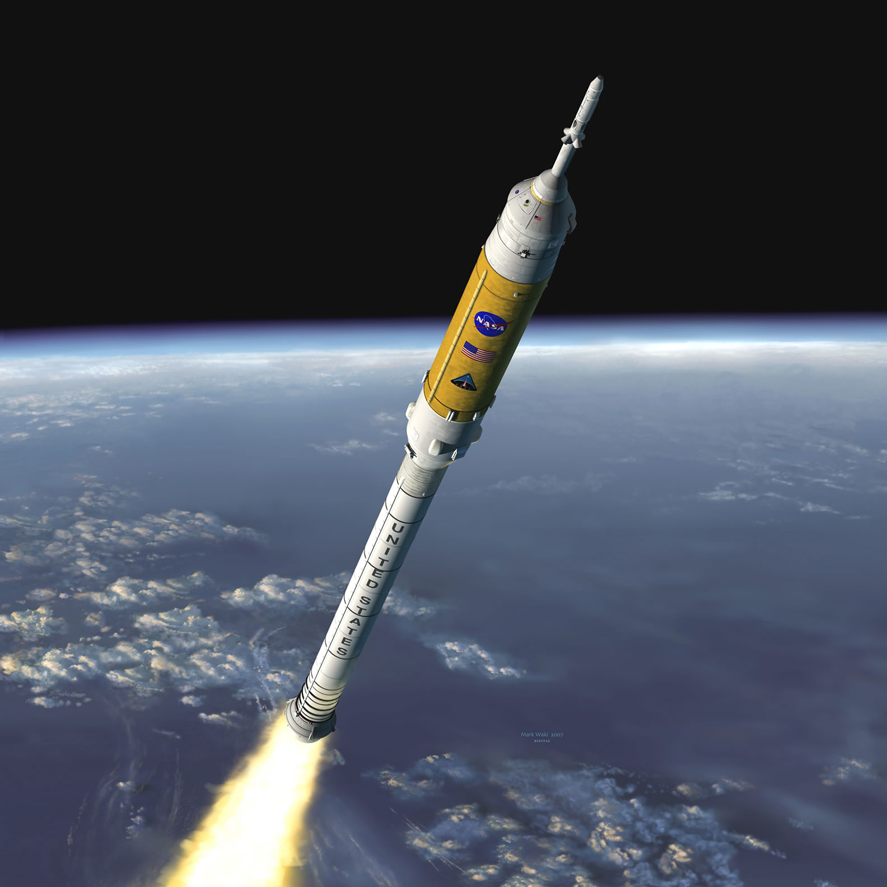
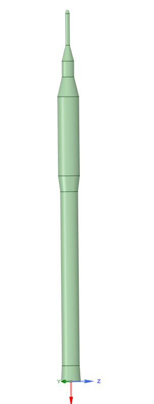
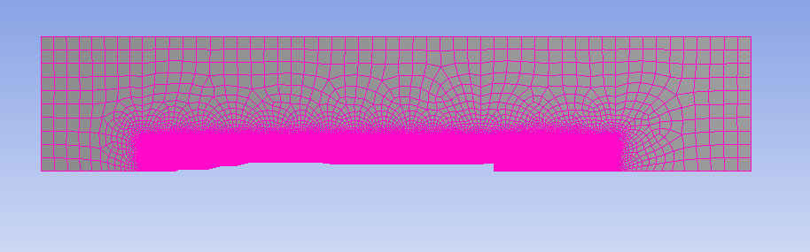
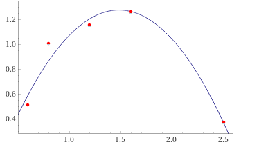
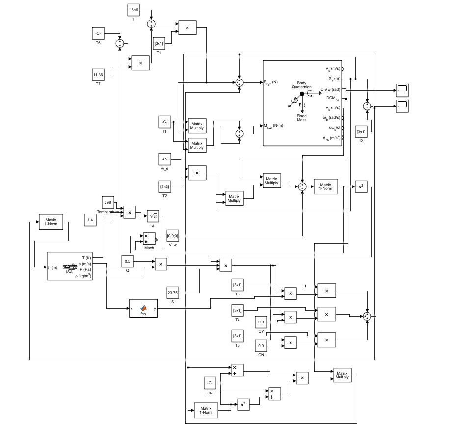
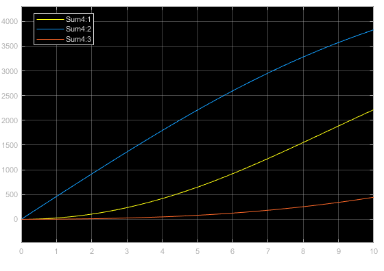

We will be setting the  equations of the six-degrees-of-freedom dynamic model of the Ares-I launch vehicle, incorporating its propulsion and aerodynamics. We are going to implement the model with a Simulink program.

## 6-DOF Dynamic model

We are going to incorporate the propulsion and aerodynamics in the equations of motion in 6-DOF. First, we need to define some useful reference frames to solve the problem.

## Reference Frames and Rotational Kinematics

### Earth-Centered Inertial Reference Frame

The earth-centered intertial frame has its origin in the center of the Earth, the z-axis normal to the equatorial plane, and x and y axes in that plane. If Earth's orbital motion around the sun is negligible in the trajectory analysis, this frame can be considered as an inertial frame. And it's the reference frame that we are going to use as the inertial frame for the resolution of the equations.

### Earth-Fixed Equatorial Reference Frame

The geocentric equatorial rotating frame with its origin at the Earth center, is fixed to Earth, so this frame has an angular velocity $\bar{\Omega}_e$.
It's useful to define this, because although it's not going to be used directly, it's used indirectly to transform from the inertial frame to the body frame.

### Body-Fixed Reference Frame

This frame is fixed to the vehicle body. Its origin is the center of mass. The i-axis is along the vehicle longitudinal axis. The k-axis perpendicular to the i-axis points downward, while the j-axis points rightward.

The inertial velocity $\bar{V}$ is:

$$ \bar{V} = u\bar{i} + v\bar{j} + w\bar{k} $$ 

The angular velocity is:

$$ \bar{w} = p\bar{i} + q\bar{j} + r\bar{k} $$

The inertial acceleration is:

$$ \dot{\bar{V}} = \dot{u}\bar{i} + \dot{v}\bar{j} + \dot{w}\bar{k} + \bar{w} \times \bar{V}$$ 

The Euler's rotational equation of motion of a rigid vehicle is:

$$ \dot{\bar{H}} = \bar{T}$$

where $\bar{H}$ is the angular momentum and $\bar{T}$ is the total external torque.

$$ \bar{H} = \hat{I}\cdot \bar{w}$$

The rotational equation of motion is:

$$ \hat{I} \cdot \dot{\bar{w}} + \bar{w} \times \hat{I} \cdot \bar{w} = \bar{T}$$

### Rotational Kinematics: Euler Angles and Quaternions

The rotational kinematic equation of the three Euler angles $(\theta_1, \theta_2, \theta_3)$ is given by:

$$ 
\begin{bmatrix}
\dot{\theta_1} \\
\dot{\theta_2} \\
\dot{\theta_3}
\end{bmatrix} = \frac{1}{cos\theta_2}
\begin{bmatrix}
cos\theta_2 & sin\theta_1 sin\theta_2 & cos\theta_1 sin\theta_2 \\ 
0 & cos\theta_1 cos\theta_2 & -sin\theta_1 cos\theta_2 \\ 
0 & sin\theta_1 & cos\theta_1  \\
\end{bmatrix}
\begin{bmatrix}
p \\
q \\
r
\end{bmatrix}
 $$

The singularity of using Euler angles can be avided using quaternions $(q_1, q_2, q_3, q_4)$

$$ 
\begin{bmatrix}
\dot{q_1} \\
\dot{q_2} \\
\dot{q_3} \\
\dot{q_4}
\end{bmatrix} = \frac{1}{2}
\begin{bmatrix}
0 & r & -q & -p \\ 
-r & 0 & p & q \\ 
q & -p & 0 & r \\
-p & -q & -r & 0 \\
\end{bmatrix}
\begin{bmatrix}
q_1 \\
q_2 \\
q_3 \\
q_4
\end{bmatrix}
 $$

We are not going to implement the transformation from body fram to intertial frame explicitly, but we are going to rely on Simulink existing package of 6-DOF solver with Euler angles.

 ## 6-DOF Equations of Motion

 The six-degree-of-freedom equations of a launch vehicle consist of the translational and rotational equations.

 $$ m \dot{\bar{V}} = \bar{F}$$

 which in internal frame is:

$$ \ddot{x}\bar{I} + \ddot{y}\bar{J} + \ddot{z}\bar{K} = \frac{\bar{F}}{m}$$

 and in the body frame:

$$ \dot{u}\bar{i} + \dot{v}\bar{j} + \dot{w}\bar{k} + \bar{\omega} \times \bar{V} = \frac{\bar{F}}{m}$$

 The Euler's rotational equation of motion of a rigid vehicle is:

 $$ \dot{\bar{H}} = \bar{T}$$

 And the angular momentum is:

 $$ \bar{H} = I\cdot\bar{w}$$

 where $\bar{w}$ is the angular velocity and $I$ is the vehicle intertia about the center of gravity.

 $$ I \cdot \dot{\bar{\omega}} + \bar{\omega} \times I \cdot \bar{\omega} = \bar{T}$$

 ### Aerodynamic Forces and Moments

 The aerodynamic forces and moments depend on the vehicle velocity with respect to the surrounding air, so assuming that the air mass is static relative to Earth, we can define the air stream velocity vector is described by

 $$ \bar{V}_m = \bar{V}_{rel} - \bar{V}_w = \bar{V} - \bar{w}_e \times \bar{r} - \bar{V}_w$$

 where $\bar{V}_{rel}$ is the vehicle velocity relative to the Earth-fixed reference frame, $\bar{V}_w$ is the local disturbance wind velocity, $\bar{V}$ is the inertial velocity of the vehicle, $\bar{w}_e$ is the Earth's rotational angular velocity and $\bar{r}$ is the vehicle position vector from Earth center. The term $\bar{w}_e \times \bar{r}$ output needs to be converted to body coordinates frame.

  $$ 
\begin{bmatrix}
V_{m,xb} \\
V_{m,yb} \\
V_{m,zb}
\end{bmatrix} = 
\begin{bmatrix}
u \\
v \\
w
\end{bmatrix}
-
C^{B/I}
\begin{bmatrix}
0 & -w_e & 0 \\
w_e & 0 & 0 \\
0 & 0 & 0
\end{bmatrix}
\begin{bmatrix}
x \\
y \\
z
\end{bmatrix}
-
\begin{bmatrix}
V_{w,xb} \\
V_{w,yb} \\
V_{w,zb}
\end{bmatrix}
$$

 The aerodynamics forces are expressed in the body-axis frame as:

 $$ D = C_D \frac{1}{2}\rho V_m^2S  -F_{base}$$

 $$ C = C_Y \beta \frac{1}{2}\rho V_m^2S$$

 $$ N = (C_{N0} + C_{N}\alpha) \frac{1}{2}\rho V_m^2S$$

 $$ \alpha = arctan(\frac{V_{m,zb}}{V_{m,xb}}) = angle of attack$$

 $$ \beta = arctan(\frac{V_{m,yb}}{V_{m}}) = sideslip angle$$

 So we have:

$$ F_{aero,xb} = -D$$
$$ F_{aero,yb} = C$$
$$ F_{aero,zb} = -N$$

 We are going to calculate the aerodynamic coefficients as a function of the Mach number with a CFD program using Fluent, and as a simplification, we are going to assume that the only aerodynamic force that is relevant to our calculations is the Drag force, we will assume and angle of attack equal to zero, the Lift is zero at zero angle of attack, and similarly the sideslip angle and the side force is zero.

The aerodynamic moments about the center of gravity are also expressed in the body-axis frame as:

$$ \begin{bmatrix}
T_{aero,xb} \\
T_{aero,yb} \\
T_{aero,zb}
\end{bmatrix}
 = 
\begin{bmatrix}
0 & c_z & -c_y \\
-c_z & 0 & -X_a + c_x \\
c_y & X_a - c_x & 0
\end{bmatrix}
\begin{bmatrix}
F_{aero,xb} \\
F_{aero,yb} \\
F_{aero,zb}
\end{bmatrix}
$$

where $X_a = 84m$ is the aerodynamic reference point in the structure, $(c_x, c_y, c_z)$ is the center of gravitywith its origin at the top of the vehicle. Let's assume $(c_x, c_y, c_z) = (67, 0.01, 0.005) m$.

 ### Gravity Model

We are going to use a very simple gravity model: 

$$ \begin{bmatrix}
g_x \\
g_y \\
g_z
\end{bmatrix} = 
\frac{\mu}{r^2}
\begin{bmatrix}
x / r \\
y / r \\
z / r
\end{bmatrix}
$$

 ### Rocket Propulsion Model

The rocket trhust is modeled as:

 $$ T = T_0 + (p_e - p_0)A_e$$

 $$ T_0 = |\dot{m}|V_e$$

 where T is the total thrust force, $t_0$ the jet thrust. $p_e$ the nozzle exit pressure, $p_0$ the local atmospheric pressure, $\dot{m}$ the propellant mass flow rate, $V_e$ the exit velocity and $A_e$ the nozzle exit area (11.36 $m^2$).

 If we know the Thrust $T^*$ at $P^* = P_0$, then

 $$ T = T^* + (P^* - P_0)A_e$$ 

 The body-axis components are:

 $$ 
\begin{bmatrix}
F_{rkt,xb} \\
F_{rkt,yb} \\
F_{rkt,zb}
\end{bmatrix} = 
\begin{bmatrix}
T \\
-T\delta_z \\
T\delta_y
\end{bmatrix}
$$

where $\delta_y$ and $\delta_z$ are the pitch and yaw gimbal deflection angles.

The body-axis components of the rocket thrust-generated torque are:

$$ \begin{bmatrix}
T_{rkt,xb} \\
T_{rkt,yb} \\
T_{rkt,zb}
\end{bmatrix}
 = 
\begin{bmatrix}
0 & c_z & -c_y \\
-c_z & 0 & -X_g + c_x \\
c_y & X_g - c_x & 0
\end{bmatrix}
\begin{bmatrix}
F_{rkt,xb} \\
F_{rkt,yb} \\
F_{rkt,zb}
\end{bmatrix}
$$

where $X_g = 90m$ is the gimbal attacj point location  in the structural frame.

## Fluent model

To calculate the aerodynamic coefficients, we are going to create a simple model of Ares I in ANSYS, and calculate the coefficients in fluent for various Mach number, that then we will approximate by a quadratic polynomial.

### Model

The model is heavily simplified. Firstly, we have obatined some approximate measurements from the following image:

Then we have assume a axylsimmetric geometry to make the calculation easiers.

The 3D model is:

An the geometry used for the calculations is the 2D drawing:

### Mesh

We have created a mesh that is finer around the body, and specially near the nozzle.

### $C_D$

| M        | $C_D$           | 
| ------------- |:-------------:| 
| 0.6     | 0.51 | 
| 0.8      | 1.01      |   
| 1.2 | 1.15     |    
| 1.6 | 1.26     |  
| 2.5 | 0.37     |  

Which using the least square error method we can approximate by a second order polynomial:

$$ C_D = -0.88M^2 + 2.61M - 0.65$$

## Results

