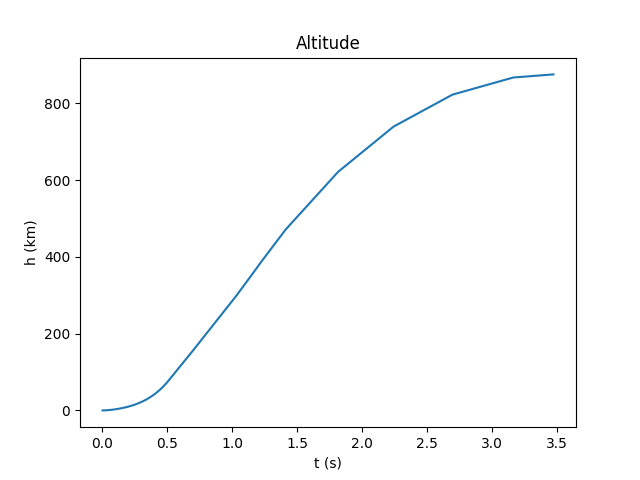
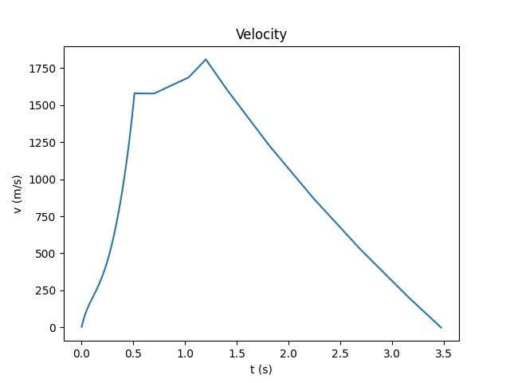
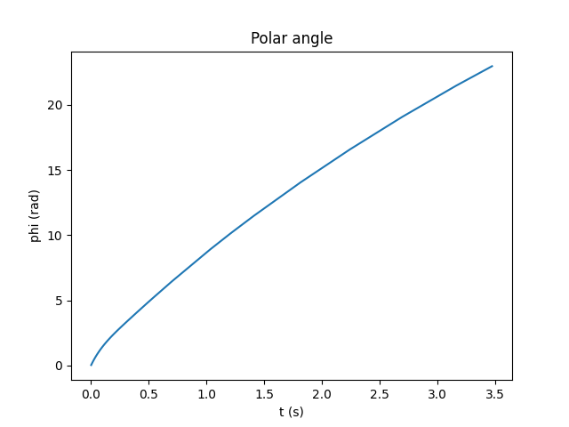
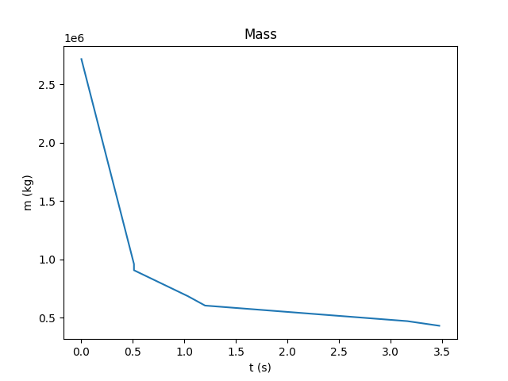
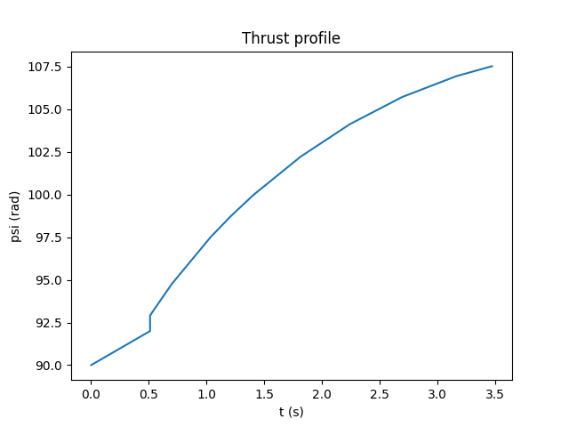

## Introduction

The trajectory for a multistage launch vehicle can be optimized to maximize the payoad, by optimizing the steering profile. If all the vehicle parameters are specified, then the problem reduces to that of find the optimum steering profile, but if some of the parameters are free, we can calculate them to optimize the payload capability.

One common situation that appears in the design of launch vehicles is that the propulsion thrust and the mass flow rate is specified, but we have some margin in the propellant mass that can be used. We can vary this to maximize the payload capability.

During the booster stage, the steering profile can't be used to optimize the payload, since it is calculated to minimize aerodynamic loads and heating, but we are going to introduce a small kick angle that is optimizable.

We are going to use the calculus of variations to optimize the payload by choosing the propellant loadings and upper-stage steering profile. The method uses Lagrange multipliers to determine the optimum value.

## Equations of Motion

$$\dot{u} - \omega^2r = - \frac{\mu}{r^2} + \frac{T_i}{m}sin\psi$$

$$ r\dot{\omega} + 2u\omega = \frac{T_i}{m}cos\psi$$

where $\psi$ is the thrust direction

We define two additional equations for the first derivatives:

$$ \dot{r} = u$$

$$ \dot{\phi} = \omega$$

And the propellant flow rate equation:

$$ \dot{m} = -\beta_i$$

for i=2, ..., N

### Booster Phase

In the booster phase we will also take into account the aerodynamic forces, but to simplify the calculation, we can assume the the angle of attack is zero, and the only aerodynamic force acting on the vehicle is the drag, which is:

$$ D = 0.5*\rho*v^2*A_{ref}*C_D$$

and will be acting on the direction of the velocity $u$.

#### Kick Angle

The launch vechicle booster stage will be allowed to have a booster kick angle $\alpha$, so the thrust direction will be varied linearly from the launch to the given input angle.

$$ \psi =  \pi/2 + (\alpha - \pi/2)\frac{t - t_0}{t_f - t_0}$$

## Variational Problem

For the variational problem we don´t consider the booster stage, because the booster steering is not subject to optimization.

The variational problem we want to solve is finding the thrust direction which maximizes the payload of an N-stage vehicle for the given boundary conditions. This problem can be formulated as a generalized Bolza problem. The functional to be minimized is:

$$ J = g + \sum_{i=2}^N \int_{i-1}^{t_i}F_idt$$

where g is a function of the initial and final conditions to be minimized, int this case the paylod.

$$ g = -m_{PL}$$

 And $F_i$ is the set of constraints added together with Lagrange multipliers, which are the equations of motion defined above. 

 $$ f_1 = \dot{u} - \omega^2r + \frac{\mu}{r^2} - \frac{T_i}{m}sin\psi = 0$$

$$ f_2 = r\dot{\omega} + 2u\omega - \frac{T_i}{m}cos\psi = 0$$

$$ f_3 = \dot{r} - u = 0$$

$$ f_4 = \dot{\phi} - \omega = 0$$

$$ f_5 = \dot{m} + \beta_i = 0$$

 ## Euler-Lagrange Equations

 In order to minime g, the Euler-Lagrange equations need to be satisfied. The Euler-Lagrange equations:

 $$ \frac{d}{dt}(\frac{\partial F_i}{\partial \dot{x}_j}) = \frac{\partial F_i}{\partial x_j}$$

 where x_J are the state variables $(u, \omega, r, \phi, m, \psi)$.

 The Euler-Lagrange equations are:

 $$ \dot{\lambda_1} = 2\omega\lambda_2 - \lambda_3$$ 

  $$ \dot{\lambda_2} = -2\omega\lambda_1 +\frac{u}{r}\lambda_2 - \frac{\lambda_4}{r}$$

  $$ \dot{\lambda_3} = -(\frac{2\mu}{r^3}  + \omega^2)\lambda_1 + \dot{\omega}\lambda_2$$ 

  $$\dot{\lambda_4} = 0$$

  $$ \dot{\lambda_5} = \frac{T}{m^2}(\lambda_1sin\psi + \lambda_2cos\psi)$$

  $$ (\lambda_1 cos\psi - \lambda_2 sin\psi) \frac{T}{m} = 0$$

  The last equation specifies the trhust direction from the lagrange multipliers. The other equations must be integrated along the equations of motion.

  ### First integral

  Because F does not depend on time explicitly, a first integral of the Euler-Lagrange equations can be calculated from:

  $$ F - \sum_{j=1}^6 \frac{\partial F}{\partial \dot{x}_j}\dot{x}_j = C$$

  ### Weierstrass-Erdmann Corner Condition

  We need to have additional boundary conditions of the Lagrange multiplers at the staging points. The Weierstrass-Erdmann corner condition states that $\partial F / \partial \dot{x}_j$ must be continuous at such corners. Calculating the derivatives we get that the multipliers must be continuous at the staging points, and hence during all trajectory. This also implies tha the thrust direction and rate must also be continuous, since they are functions of the multipliers.

  ## Boundary Equations

  When some of the problem variables are not specified at the boundary, we can choose them to minimize J. The conditions for the independent variables will be:

  $$ \frac{\partial J}{\partial x_j} = 0 $$

  In general we can consider the state variables as independent, but the not the propellant mass and kick angle. 
  
  If $r$, $u$, $omega$, $\phi$ are independent variables, and $phi$ is not specified:

$$ G(phi) = \lambda_4 = 0 $$

and 

$$ \dot{\lambda_4} = 0 $$
  
  The propellant mass can be expressed as functions of the burning times of the stages:

  $$ m_i^0 = m_0 - \sum_{l=1}^{i-1}[(1+k_l)\beta_l \tau_l + m_{H,l}]$$

  $$ m_i^f = m_0 - \sum_{l=1}^{i-1}[(1+k_l)\beta_l \tau_l + m_{H,l}] - \beta_i \tau_i$$

  where $m_0$ is the lift-off mass and $m_{H,l}$ and $k_l$ are the fixed hardware mass and propellant tank fraction for each stage.

  The final payload is

  $$ m_{PL} = \gamma \{m_0 - \sum_{l=1}^{N-1}[(1 + k_l)\beta_l\tau_l + m_{H,l}] - \beta_N\tau_N \} - k_N\beta_N\tau_N - m_{H,N} $$

  where

$$ \gamma = -k_N + (1+k_N)e^{\Delta V_I \beta_N / T_N} $$

$\Delta V_I$ is the velocity impulse.

With this we can calculate the boundary conditions which will be:

$$  G(\tau_i) = (1 + k_i)\beta_i[\gamma + \sum_{l=i+1}^N(S_l^f - S_l^0)] + \beta_iS_i^f \qquad \beta_i \neq 0 \quad \quad i = 1, ..., N-1$$

$$  G(\tau_i) = C_i \qquad \beta_i = 0 \quad \quad i = 1, ..., N-1$$

$$ G(\tau_N) = (\gamma +k_N)\beta_N + \beta_NS_N^f $$

$$ G(\alpha) = -(\lambda_1 \frac{\partial u}{\partial \alpha} + r \lambda_2 \frac{\partial \omega}{\partial \alpha} + \lambda_3 \frac{\partial r}{\partial \alpha} + \lambda_4 \frac{\partial \phi}{\partial \alpha})_{t=t_1}$$

$$ G(\eta) = -(\lambda_1 \frac{\partial u}{\partial \eta} + r \lambda_2 \frac{\partial \omega}{\partial \eta} + \lambda_3 \frac{\partial 4}{\partial \eta} + \lambda_4 \frac{\partial \phi}{\partial \eta})_{t=t_N} \qquad j=1,...,4$$

With:

$$ S_i^f = \frac{[(\frac{\mu}{r^2} - \omega^2 r)\lambda_1 + 2u\omega\lambda_2 - u\lambda_3 - \omega\lambda_4 - \frac{T_i}{m_i^f}\sqrt{\lambda_1^2 + \lambda_2^2}]_{t=t_i}}{\beta_i} \qquad \beta \neq 0 \quad i=2, ..., N$$

$$ S_i^0 = \frac{[(\frac{\mu}{r^2} - \omega^2 r)\lambda_1 + 2u\omega\lambda_2 - u\lambda_3 - \omega\lambda_4 - \frac{T_i}{m_i^0}\sqrt{\lambda_1^2 + \lambda_2^2}]_{t=t_{i-1}}}{\beta_i} \qquad \beta \neq 0 \quad i=2, ..., N$$

$$ C_i = [(\frac{\mu}{r^2} - \omega^2 r)\lambda_1 + 2u\omega\lambda_2 - u\lambda_3 - \omega\lambda_4]_{t=t_{i-1}} \qquad \beta = 0 \quad t_{i-1} \leq t \leq t_i$$

### Lagrange Multipliers

It is difficult to guess initial values for the Lagrange multipliers, but we can relate the Lagrange multipliers to physical variables, such as the pitch attitude $\psi$ and rate $\dot{\psi}$.

$$ tan \psi = \frac{\lambda_1}{\lambda_2}$$

$$ sin \psi = \frac{\lambda_1}{\sqrt{\lambda_1^2 + \lambda_2^2}}$$

$$ cos \psi = \frac{\lambda_2}{\sqrt{\lambda_1^2 + \lambda_2^2}}$$

If we define $\lambda_0 = \sqrt{\lambda_1^2 + \lambda_2^2}$ then:

$$ \lambda_0 sin \psi = \lambda_1$$

$$ \lambda_0 cos \psi = \lambda_2$$

We can consider $\lambda_0$ as a scale factor. 

And differentiating the previous equations and merging with the Euler Lagrange equations:

$$ \dot{\psi} = 2\omega - \frac{(\lambda_2\lambda_3 + \frac{u}{r}\lambda_1\lambda_2) - \frac{\lambda_1\lambda_4}{r})}{\lambda_1^2 + \lambda_2^2}$$

Then we can use the above equations to solve for $\lambda_3$:

$$ \lambda_3 = \frac{\lambda_0}{cos \psi}(2\omega - \dot{\psi} - \frac{u}{r}sin\psi cos\psi) + \frac{\lambda_4}{r}tan\psi \qquad \psi \neq \pi/2$$.

So if $\lambda_4=0$, then the multipliers $\lambda_1$, $\lambda_2$, $\lambda_3$ can be calculated $\psi$, $\dot{\psi}$ and $\lambda_0$.

From $G(\alpha) = 0$, we could obtain one $\lambda$. 

$$ \lambda_1 \frac{\partial u}{\partial \alpha} + r \lambda_2 \frac{\partial \omega}{\partial \alpha} + \lambda_3 \frac{\partial 4}{\partial \alpha} + \lambda_4 \frac{\partial \phi}{\partial \alpha} = 0$$

in terms of $\psi$ and $\dot{\psi}$

$$ \lambda_0sin\psi\frac{\partial u}{\partial \alpha} + r\lambda_0cos\psi\frac{\partial \omega}{\partial \alpha} + [\frac{\lambda_0}{cos\psi}(2\omega - \dot{\psi} - \frac{u}{r}sin\psi cos\psi) + \frac{\lambda_4}{r}tan \psi]\frac{\partial r}{\partial \alpha} + \lambda_4\frac{\partial \phi}{\partial \alpha}$$

Which can be solved for $\dot{\psi}$. If $\lambda_4 = 0$:

$$ \dot{\psi} = 2\omega - \frac{u}{r}sin\psi cos\psi + \frac{cos\psi}{\frac{\partial r}{\partial \alpha}}(sin\psi \frac{\partial u}{\partial \alpha} + rcos\psi\frac{\partial \omega}{\partial \alpha})$$

## Initial conditions

The optimization state will be $(\lambda_0, \psi, \lambda_4, \alpha, \tau_i)$, but we will usually consider $\lambda_4 = 0$.

## Example

## Three-Stage Launch to a Given Altitude

As an example we are going to consider a three-stage launch vehicle. The propulsion and weights used are:

<table style="margin-left: auto;
    margin-right: auto;"
  >
  <tr>
    <td></td>
    <td colspan="3">
      Stage
    </td>
  </tr>
  <tr>
    <td></td>
    <td>First</td>
    <td>Second</td>
    <td>First</td>
  </tr>
  <tr>
    <td>Thrust (N)</td>
    <td>3.3362e7</td>
    <td>6.672e6</td>
    <td>2.12e6</td>
  </tr>
  <tr>
    <td>Specific Impulse (s)</td>
    <td>264</td>
    <td>428</td>
    <td>850</td>
  </tr>
  <tr>
    <td>k Propellant fraction</td>
    <td>0.03</td>
    <td>0.033</td>
    <td>0.12</td>
  </tr>
  <tr>
    <td>Drag reference area (m^2)</td>
    <td>79.43</td>
    <td>-</td>
    <td>-</td>
  </tr>
</table>

We want to put the vehicle at an orbit of 860 km, with the injection point unspecified, so the final conditions are:

$$r = r_d$$
$$u = 0$$
$$\omega = \sqrt{\frac{\mu}{r_d^3}}$$

If we don't put any final condition on $\phi$, then we have the condition 

$$G(\phi) = \lambda_4 = 0$$

And since $\dot{\lambda_4} = 0$, we know that $\lambda_4 = 0$.

With this simplification we can remove one additional initial value of one lagrange multiplier. First, let's express two of the multipliers in terms of the pitch attitude $\psi$ and rate $\dot{\psi}$.

$$tan\psi = \frac{\lambda_1}{\lambda_2}$$

Differentiating this equation gives:

$$\dot{\psi}sec^2\psi = \frac{\lambda_2\dot{\lambda_1} - \lambda_1\dot{\lambda_2}}{\lambda_2^2}$$

$$\dot{\psi} = 2\omega - \frac{\lambda_2\lambda_3 + u/r\lambda_1\lambda_2 - \frac{\lambda_1\lambda_4}{r}}{\lambda_1^2 + \lambda_2^2}$$

and if we make the transformation

$$\lambda_1 = \lambda_0sin\psi$$

$$\lambda_2 = \cos\psi$$

we can get

$$\lambda_3 = \frac{\lambda_0}{cos\psi}(2\omega - \dot{\psi} - (u/r)sin\psi cos\psi) + (\lambda_4/r)tan\psi$$

So the multipliers $\lambda_1$, $\lambda_2$, $\lambda_3$ can be calculated from $psi$, $\dot{\psi}$, $\lambda_4$ and $\lambda_0$.

In this case we can also use the booster kick angle optimization equation to calculate $\dot{\psi}$, and remove it from the optimization problem.

$$\lambda_1\frac{\partial u}{\partial \alpha} + r\lambda_2\frac{\partial \omega}{\partial \alpha} + \lambda_3\frac{\partial r}{\partial \alpha} + \lambda_4\frac{\partial \phi}{\partial \alpha} = 0$$

which can be solved with the previous equations to give:

$$\dot{\psi} = 2\omega - (u/r)sin\psi cps\psi + \frac{\lambda_4 sin\psi}{\lambda_0 r} + \frac{cos\psi}{\frac{\partial r}{\partial \alpha}}(sin\psi \frac{\partial u}{\partial \alpha} + rcos\psi \frac{\partial \omega}{\partial \alpha} + \frac{\lambda_4}{\lambda_0}\frac{\partial \phi}{\partial \alpha})$$

## Results

